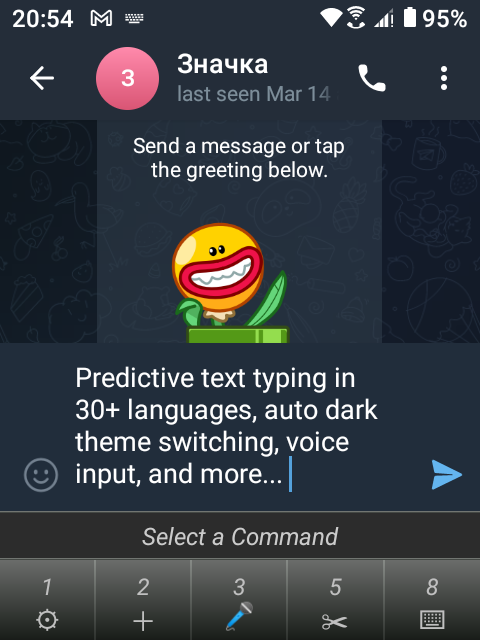
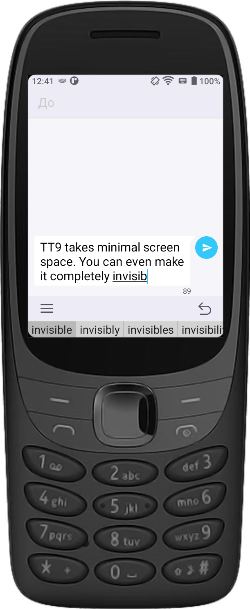
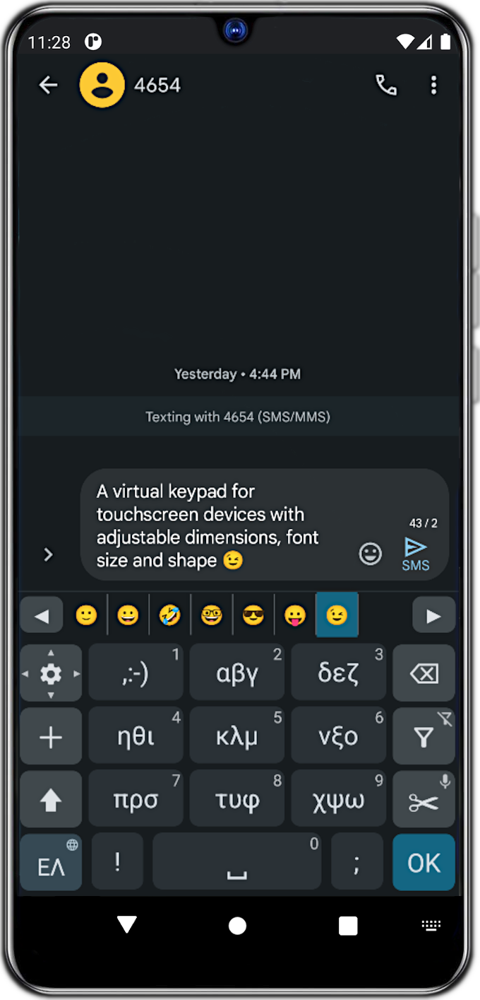
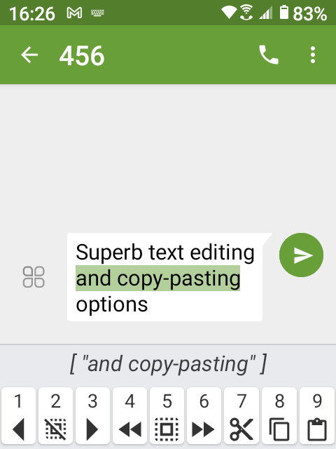

# Traditional T9 

TT9 is a 12-key T9 keyboard for devices with a hardware numpad. It supports predictive text typing in [40+ languages](app/languages/definitions), configurable hotkeys, text editing with undo/redo, and an on-screen keypad that can turn your smartphone into a Nokia from the 2000s. And, best of all, it [doesn't spy](docs/privacy.md) on you!

This is a modernized version of the [original project](https://github.com/Clam-/TraditionalT9) by Clam-.

## 📷 Screenshots
<table>
    <tr>
        <td>  </td>
        <td rowspan="2">  </td>
        <td rowspan="2">  </td>
        <td rowspan="2">  </td>
    </tr>
    <tr>
        <td>  </td>
    </tr>
</table>

## 📦 Install

&nbsp;&nbsp;&nbsp;&nbsp;
&nbsp;&nbsp;&nbsp;&nbsp;
&nbsp;&nbsp;&nbsp;&nbsp;

_If your phone does not have Google Play and does not allow installing custom APKs, please consult the [Installation Guide](docs/installation.md)._

## ⚙️ System Requirements
- Android 5.0 or higher.
- A hardware keypad or a keyboard. For touchscreen-only devices, an on-screen keypad can be activated from the Settings.
- Storage space depends on the Android version. The lite version requires at least 6-8 Mb and the full version requires at least 220 Mb.
- Extra storage space is necessary for language dictionaries in Predictive Mode.
    - Languages with character predictions only (Korean): ~1 Mb per language
    - Tiny languages (< 100k words; Kiswahili, Indonesian, Vietnamese): 5-6 Mb per language.
    - Small languages (100k-400k words; e.g. English, Norwegian, Swedish, Finnish, French): 15-30 Mb per language.
    - Medium languages (400k-800k words; e.g. Chinese, Danish, Greek, Italian, Portuguese): 40-75 Mb per language
    - Large languages (800k-1.6M words; e.g. Arabic, Bulgarian, Hebrew, Japanese, Romanian, Spanish): 100-170 Mb per language

_Storage usage for the dictionaries depends on the word root count and the average word length in each language. Some languages will require more space, even if they have fewer words than others._

### ⚠️ Compatibility
If you own a phone with Android 4.4, the latest TT9 version you can use is [v44.0](https://github.com/sspanak/tt9/releases/tag/v44.0). On devices with Android 4.3 or earlier, please refer to the original Traditional T9 from 2016.

TT9 may not work well on TCL Flip 2, Kyocera phones, especially ones running Android 10 or newer, or other devices that run highly customized Android versions, where all apps are integrated and intended to work with the respective native keyboard. You may experience missing functionality, empty gaps/misaligned items on the screen, or unexpected text/numbers appearing when you try to type.

Compatibility has been verified only on the following devices:
- CAT S22 Flip (Android 11)
- Unihertz Atom L (Android 11)
- Qin F21 Pro+ (Android 11)
- Energizer H620SEU (Android 10)
- Sonim XP3800 (Android 8.1)
- Vodaphone VFD 500 (Android 6.0)

## 🤔 How to Use Traditional T9?
Before using Traditional T9 for the first time you need to configure it and load a dictionary. After that, you can start typing right away in one of the three modes: Predictive, ABC, or Numeric (123). And even if you have mastered the keypad back in the day, you will still find the Predictive mode now offers more powerful and smart new ways of typing with even fewer key presses.

So make sure to read the initial setup and the hotkey tips in the [user manual](docs/help/help.en.md). Also, don't miss the convenient [compatibility options](docs/help/help.en.md#compatibility-options) aimed to improve the experience in some applications.

_The user manual is also available in: [Brazilian Portuguese](docs/help/help.pt.md), [German](docs/help/help.de.md), [French](docs/help/help.fr.md), [Italian](docs/help/help.it.md), [Russian](docs/help/help.ru.md), [Spanish](docs/help/help.es.md), [Turkish](docs/help/help.tr.md), [Ukrainian](docs/help/help.uk.md)._

## ⌨ Contributing
As with many other open-source projects, this one is also maintained by its author in his free time. Any help in making Traditional T9 better will be highly appreciated. Here is how:
- Add [a new language](CONTRIBUTING.md#adding-a-new-language), [new UI translations](CONTRIBUTING.md#translating-the-ui) or simply fix a spelling mistake. The process is very simple and even with minimum technical knowledge, your skills as a native speaker will be of great use. Or, if you are not tech-savvy, just [open a new issue](https://github.com/sspanak/tt9/issues) and put the correct translations or words there. Correcting misspelled words or adding new ones is the best you can do to help. Processing millions of words in multiple languages is a very difficult task for a single person.
- Share your list of added words. Use the Export function in Settings → Languages → Added Words and upload the generated CSV file in a [new issue](https://github.com/sspanak/tt9/issues). You are also welcome to [open a PR](https://github.com/sspanak/tt9/pulls) if you have good technical knowledge and can split them by language.
- [Report bugs](https://github.com/sspanak/tt9/issues) or other unusual behavior on different phones. It is only possible to verify correct operation and compatibility on a handful of phones, but Android behavior and appearance vary a lot across the millions of devices available out there.
- Experienced developers, who are willing to get your hands dirty with the code, see the [Contribution Guide](CONTRIBUTING.md).

Your PRs are welcome!

## 👍 Support
The easiest way to support the project is to give it a star on GitHub. Higher-ranked projects can use development tools for free and apply for funding more easily. You can also give it five stars on Google Play to increase its rating, prompting the Play Store to recommend it to more people.

If you truly enjoy using TT9, buy me a beer on [Ko-Fi](https://ko-fi.com/sspanak) or [PayPal](https://www.paypal.com/donate/?hosted_button_id=LW97X3JM2CRZC).

## 💪 Philosophy
- No ads, no premium or paid features. It's all free.
- No spying, no tracking, no telemetry or reports. No nothing!
- No unnecessary bells or whistles. It only does its job, typing.
- No unnecessary permissions. The Full version operates entirely offline, the Lite version connects only to download dictionaries from GitHub. Voice Input may require Internet access depending on the available voice services.
- Open-source, so you can verify all the above yourself.
- Created with help from the entire community.
- Things it will (probably) never have: QWERTY layout, swipe-typing, GIFs and stickers, backgrounds, or other customizations. "It can be any color you like, as long as it is black."
- Not intended as a clone of Touchpal, Sony Ericsson, KaiOS, Samsung, etc. It is understandable to miss your favorite old phone or keyboard app, but TT9 has its own unique design, inspired by the Nokia 3310 and 6303i. While it captures the feel of the classics, it offers its own experience and won’t replicate any device exactly.

Thank you for understanding, and enjoy TT9!

## 🕮 License
- The source code, the logo image, and the icons are licensed under the conditions described in [LICENSE.txt](LICENSE.txt).
- The dictionaries are licensed under the licenses provided in the [respective readme files](docs/dictionaries), where applicable. Detailed information about the dictionaries is also available there.
