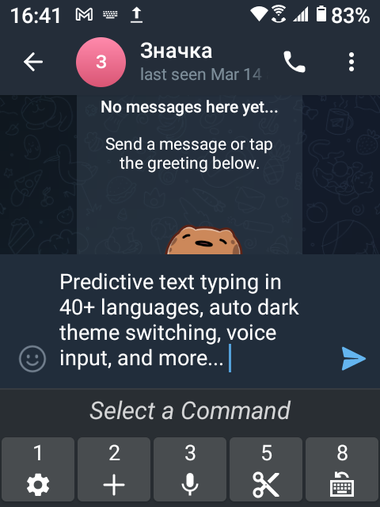

# Traditional T9
TT9 is an IME (Input Method Editor) for Android devices with a hardware keypad. It supports predictive text typing in [multiple languages](assets/languages/definitions) and configurable hotkeys, bringing old school Nokia experience to modern Android devices.

This is a modernized version of the [original project](https://github.com/Clam-/TraditionalT9) by Clam-.

or get the APK from the [Releases Section](https://github.com/sspanak/tt9/releases/latest).

## Screenshots

  
 

## System Requirements
- Android 4.4 or higher. _(Tested and confirmed on Android 4.4.2, 10 and 11)_
- Free space:
  - Minimum 30 Mb when not using Predictive mode and no dictionaries are loaded.
  - Plenty of space per each enabled language in Predictive mode (25-100 Mb, depending on the word count).
- A hardware keypad or a keyboard. For touchscreen-only devices, an on-screen keypad can be enabled in the Settings.

_If you own a phone with Android 2.2 up to 4.4, please refer to the original version of Traditional T9 from 2016._

## How to use Traditional T9?
Before using Traditional T9 for the first time you would need to load a dictionary and configure it. After that, you could start typing right away in one of the three modes: Predictive, ABC or Numeric (123). And even if you have mastered the keypad back in the days, you would still find the Predictive mode now provides powerful and smart new ways of typing with even less key presses.

So make sure to read the initial setup and the hotkey tips in the [user manual](docs/user-manual.md).

## Contributing to the Project
As with many other open-source projects, this one is also maintained by its author in his free time. Any help in making Traditional T9 better will be highly appreciated. Here is how:
- [Report bugs](https://github.com/sspanak/tt9/issues) or other unusual behavior on different phones. Currently, the only testing and development devices are: Qin F21 Pro+ / Android 11; Energizer H620SEU / Android 10. But Android behaviour and appearance varies a lot across the millions of devices available out there.
- Add [a new language](CONTRIBUTING.md#adding-a-new-language), [new UI translations](CONTRIBUTING.md#translating-the-ui) or simply fix a spelling mistake. The process is very simple and even with minimum technical knowledge, your skills as a native speaker will be of great use. Or, if you are not tech-savvy, just [open a new issue](https://github.com/sspanak/tt9/issues) and put the correct translations there.
- Experienced developers who are willing fix a bug, or maybe create a brand new feature, see the [Contribution Guide](CONTRIBUTING.md).

Your PRs are welcome!

## Supporting the Project
If you like Traditional T9, buy me a beer. Donations are currently accepted on [buymeacoffee.com](https://www.buymeacoffee.com/sspanak).

## License
- The source code, the logo image and the icons are licensed under the conditions described in [LICENSE.txt](LICENSE.txt).
- The dictionaries are licensed under the licenses provided in the [respective readme files](docs/dictionaries), where applicable. Detailed information about the dictionaries is also available there.
- [Silver foil photo created by rawpixel.com - www.freepik.com](https://www.freepik.com/photos/silver-foil)
- "Negotiate" and "Vibrocentric" fonts are under [The Fontspring Desktop/Ebook Font End User License](docs/desktop-ebook-EULA-1.8.txt).

## Privacy Policy
Traditional T9 never sends any sort of "telemetry", "reports" or your personal details anywhere. It has no network connectivity capabilities.
